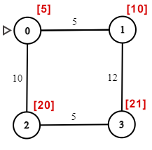
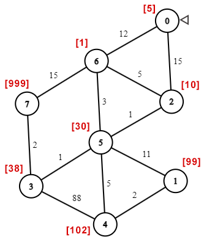

# Задача #1
## Баллы: 3 + 3
## Условие:

Во время очередных своих приключений Индиана Джонс нашел гробницу древних индейцев, в
которой по легенде... что... **СТОП**. Все это уже было. Гробница, ловушки, сундуки с сокровищами.
Индиана с ужасом потряс головой, он снова и снова попадал в эту затхлую гробницу, из которой найти выход может помочь
только знание теории графов. Похоже, он все-таки наступил на одну из ловушек индейцев, которая коварно заперла его во временной петле.
Все это уже было... но в этот раз что-то чуть заметно изменилось.

Наш герой решил осмотреться, дошел до противоположного края первой комнаты и наконец понял, в чем дело.
В этот раз он стоит не просто в начале лабиринта, у его ног целый древний город Майя с множеством покинутых улиц,
храмов в виде **пирамид** и опустевших каналов. Чтобы выбраться из этого замкнутого круга, ему нужно придумать что-то
принципиально новое. В этот же момент из стены выдвинулись большие (хотя, скорее среднего размера) песочные часы,
из верхней половины которых сразу побежали вниз шустрые песчинки. Индиана понял, что **в этот раз время ограничено**,
и как только оно выйдет, ему конец. Нужно было **торопиться**!

Тем не менее вводные оставались прежними. Индиана Джонс сохранил у себя подробную карту города и
переходов в гробницах, которую выторговал у старого индейца. В карте указано, где и какие именно сокровища нужно искать,
а также перечислены все ловушки, расположенные в переходах (карта в этот раз просто огромная).

У нашего героя все еще есть и магический амулет, который сможет защитить его от ловушек.
У амулета есть заряд, после того, как он спасает от очередной ловушки, заряд уменьшается. Разные
ловушки уменьшают заряд на разную величину, но в карте эти величины указаны.

Единственным условием, которое поставил тот индеец, было то, что Индиана Джонс заберет лишь одно
сокровище. Как только он возьмет его в руки, все ловушки отключатся, и он сможет спокойно выйти
из гробницы.

Естественно, Индиана Джонс был знаком с теорией графов. С ее помощью он без труда добрался до
самого ценного (насколько позволял заряд амулета) сокровища и вынес его из города, разорвав временную петлю.

Вам необходимо написать программу, которая по заданной карте и заряду амулета возвращает
стоимость сокровища, которое вынес из города Индиана Джонс.

## Формат входных данных:
Вам необходимо написать программу, принимающую на вход две строки: имена входного и выходного файлов.

В файле с входными данными записаны три значения:

**P** **N** **M** – заряд амулета; количество комнат; количество переходов;

В следующих **M** строках описаны переходы и ловушки в формате:

**from** **to** **value** – номер комнаты, откуда идет переход; номер комнаты, куда идет переход; значение, на которое ослабляет амулет ловушка из этого перехода;

В следующих **N** строках записаны стоимости сокровищ, находящихся в соответствующих комнатах. (kая строка соответствует k-ой комнате)

Считать, что начальная комната имеет номер 0.

## Формат выходных данных:
В выходной файл необходимо записать стоимость сокровища, которое вынес из города Индиана Джонс.

## Пример входных и выходных данных:

|   input  |     output    |  устройство лабиринта |
|----------|:-------------:|:-------:|   
| 15 4 4  0 1 5 0 2 10 1 3 12 2 3 5 5 10 20 21|21||
||||
| 17 8 12 0 6 12 0 2 15 2 6 5 2 5 1 6 5 3 5 3 1 6 7 15 7 3 2 3 4 88 5 4 5 5 1 11 1 4 2 5 99 10 38 102 30 1 999 |38||

## Система тестирования:
Для прохождения автоматических тестов вам нужно адаптировать **Makefile** в репозитории под свои нужды в зависимости от того,
какой язык вы используете для решения задачи. Для этого нужно обновить значение переменной **RUNNABLE**, указав там то,
что будет запускаться для тестирования. И при необходимости добавить шаги по сборке вашего решения.

В закомментированной части **Makefile** вы можете увидеть два примера: для языков Python и C.

## Система оценивания:

Количество начисляемых за задачу баллов зависит от реализованной и использованной в решении структуры данных.
Наивное решение, дающие квадратичную сложность даст **0 баллов**, **даже если оно уложилось в ограничение по времени**! 
Ведь в таком случае, прохождение тестов - это не ваша заслуга, а следствие допустимости использования (почти) любых 
языков программирования, включая языки с относительно медленной реализацией.

Решение, гарантирующее сложность O((V + E)*log|V|), принесет вам **3 балла**.
Наконец, решение, дающее сложность O(|V|*log|V| + |E|), принесет вам еще 3 балла, т.е. в сумме **6 баллов**.

Пользоваться библиотечными структурами данных (кроме массивов) **запрещено**.
